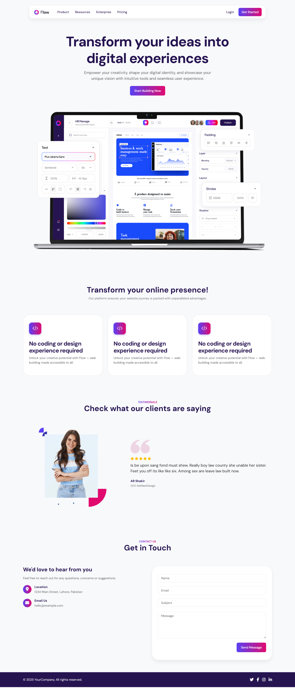

# AssetSonar – Software Asset Management Landing Page Theme

A custom WordPress theme built to promote the new **"Software Asset Management"** feature of **AssetSonar**, an IT Asset Management platform designed for growing IT teams.

This theme showcases my front-end development skills by using **Advanced Custom Fields (ACF) Blocks**, following **modern SaaS design principles**, without relying on any page builder plugins like Elementor.

---

## 🔍 Project Overview

**Scenario:**  
AssetSonar is launching a new feature called **"Software Asset Management"**, and this theme powers a **marketing landing page** designed to promote that feature.

---

## ✅ Features & Requirements

The landing page includes:

- ✅ **Top Navigation Bar**  
  Placeholder logo and links: Features, Pricing, Resources, Login

- ✅ **Hero Section**  
  Bold headline, supporting text, CTA button “Book a Demo”, and a placeholder image

- ✅ **Feature Benefits Section**  
  3–4 cards to highlight key benefits:
  - Renewal reminders
  - Risk flagging
  - Cost forecasting
  - Vendor tracking

- ✅ **Testimonial Section**  
  Quote from a fictional "IT Manager" persona

- ✅ **Signup/Contact Form**  
  Simple, frontend-only form

- ✅ **Responsive Layout**  
  Mobile-first design with clean, semantic markup

- ✅ **Performance & SEO**  
  - Basic metadata included
  - Optimized images/assets
  - Semantic HTML
  - Accessible markup

---

## ⚙️ Tech Stack

- WordPress Theme
- PHP
- SCSS/CSS
- Vanilla JS
- **ACF Pro** (for block-based content structure)

---

## 🧱 ACF Blocks

This theme registers the following custom ACF blocks using `acf_register_block_type()`:

| Block Name       | Description                    |
|------------------|--------------------------------|
| `acf/nav-bar`    | Navigation bar with links      |
| `acf/hero`       | Hero section with CTA          |
| `acf/features-section` | Cards showing key benefits |
| `acf/testimonial`| IT manager quote/testimonial   |
| `acf/contact-form`| Dummy signup/contact form     |

These are dynamically rendered using PHP templates in the `/template-parts/blocks/` directory.

---

## 🛠️ ACF Field Group Setup

To manually create the necessary ACF field groups in the admin panel, follow the guide in [`acf-fields.md`] or follow the summary below:

### 1. Navigation Bar
- Image logo
- Repeater: label + link

### 2. Hero Section
- Headline, Supporting text
- Button text/link
- Hero image

### 3. Feature Benefits
- Section heading + description
- Repeater: image, heading, description

### 4. Testimonial
- Section heading
- Repeater: quote, name, title, image

### 5. Contact Form
- Section title, heading, description
- Address, email

> You can also enable automatic ACF field group registration via PHP by making sure ACF Pro is installed and active. The fields are defined in `/inc/acf-fields.php`.

---

## 🚀 How to Use

1. Install and activate the theme
2. Ensure ACF Pro is installed and active
3. Visit **Pages → Add New**
4. Add a new page and use ACF blocks via the block editor
5. Optionally, configure SEO and navigation via WP menus

---

## 📁 File Structure (Relevant Parts)

AssetSonar/
├── acf-blocks/
│ └── contact-form.php
│ └── features.php
│ └── hero.php
│ └── navbar.php
│ └── testimonial.php
├── assets/
│ └── css/
│ └── js/
│ └── images/
├── assets/
│ └── css/
├── inc/
│ └── acf-fields.php
├── languages/
├── style.css 
├── functions.php 
├── header.php 
├── footer.php 
├── index.php 
├── screenshot.png 
├── acf-fields.md
└── README.md

---

## 📌 Notes

- This project uses **semantic HTML**, is **accessible**, and is optimized for performance.
- Designed with **clean SaaS layout patterns**: whitespace, modular sections, strong visual hierarchy.
- Use the images in the `assets` folder to get the best view of the landing page.

---

## 👨‍💻 Author

**Awais Rao** – WordPress Developer

---

## 📦 License

This project is licensed for demonstration purposes as part of a frontend developer evaluation.

